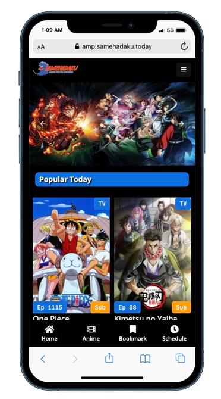

# Google AMP Streaming site Samehadaku

## Description
This is a simple streaming site for anime, using Google AMP (Accelerated Mobile Pages) to make it faster and more mobile-friendly. This site is a clone of [Samehadaku](https://samehadaku.today/), a popular anime streaming site.
The content we use API from [Samehadaku](https://samehadaku.today/), and We Cache the data to make it faster using Redis.

## Screenshots

## Features
- [x] Home
- [x] Anime List
- [x] Bookmark
- [x] Schedule
